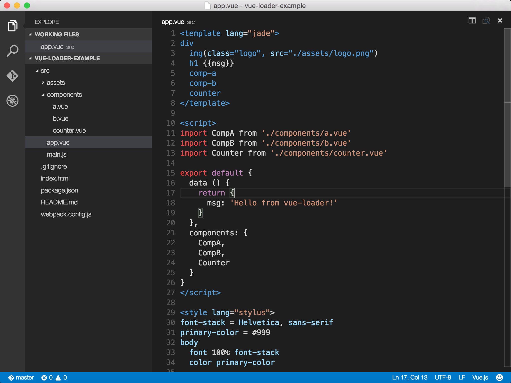

# vscode-vue
Syntax Highlight for Vue.js

## Oops

Sorry for the bad news: ES2015 support is still buggy.

When using embeded `<script>` JavaScript code **can not** trigger VSC's JavaScript language support. That means Intellisense won't work with embeded `<script>` tags.

So using ES2015 may cause the syntax highlighting broke **below** the `<script>` tag when using some new ES2015 syntaxes (E.G. `export default`).

I'm still working on how to make VSC to enable full-featured JavaScript language support.

For now, if you want to activate the syntax highlighting, you can move the `<style>` tag **above** the `<script>` tag in `.vue` files. But you still can't get full-featured JavaScript language support, including Intellisense.

Visual Studio Code

## Install

`ext install` in Visual Studio Code command line

Search for `vue` and click install

## Screenshots

## Code Snippets

|trigger|snippet|
|-------|-------|
|`vud-cdn`|`<script>` tag to cdnjs|
|`add`|`vm.$add`|
|`delete`|`vm.$delete`|
|`eval`|`vm.$eval`|
|`set`|`vm.$set`|
|`get`|`vm.$get`|
|`ipo`|`vm.$interpolate`|
|`log`|`vm.$log`|
|`wat`|`vm.$watch`|
|`vue`|`new Vue`|
|`vue-config`|`Vue.config`|
|`vue-dir`|`Vue.directive`|
|`vue-extend`|`Vue.extend`|
|`vue-filter`|`Vue.filter`|
|`v`|`an empty object`|
